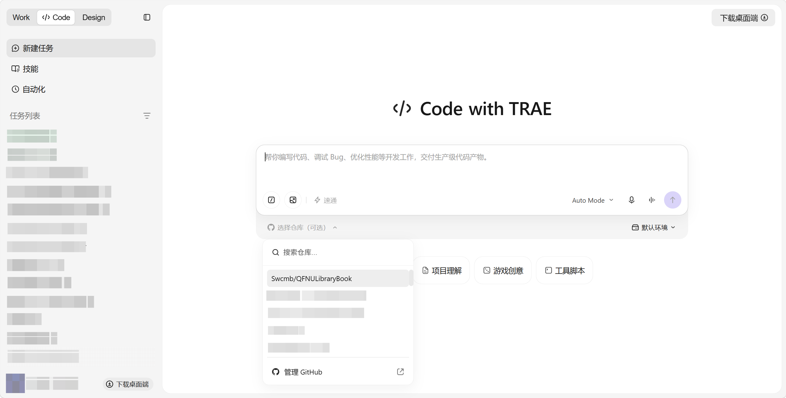
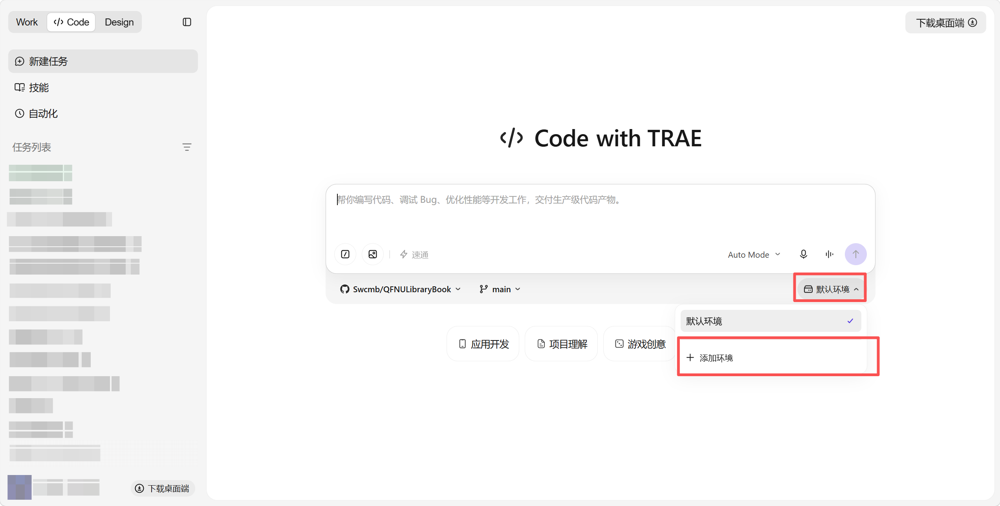
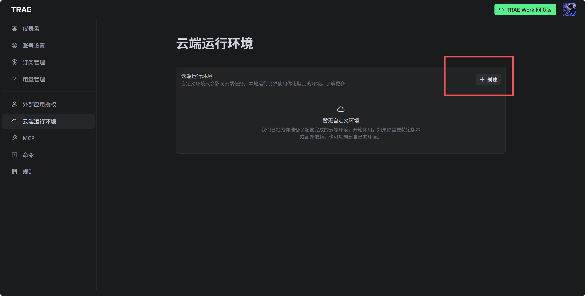
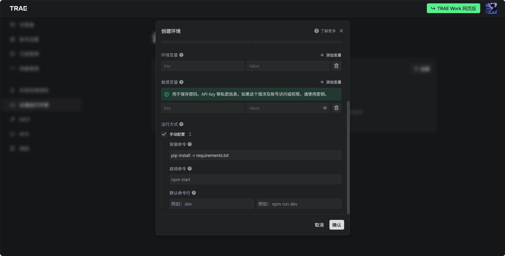

# QFNULibraryBook

> 曲阜师范大学图书馆座位自动预约系统 — 支持自动预约、签到、签退全流程自动化。

[](LICENSE)

## 项目简介

自动化完成曲阜师范大学图书馆自习室座位的**预约 → 签到 → 签退**三阶段流程，支持多用户、多教室、多渠道通知推送。目标系统为 `http://libyy.qfnu.edu.cn`。

## 免责声明

本脚本仅供学习使用。使用本脚本预约座位后，请合理、有效地利用座位时间进行学习，不得恶意占用座位或空占资源。

- 本项目不对因违规使用或不当操作而导致的任何后果承担责任
- 请自觉遵守图书馆的相关规定，共同维护良好的学习环境

## 功能特点

- **多种预约模式**：指定范围+插座、插座优先、完全随机、指定座位（4 种模式）
- **自动签到签退**：支持到点自动签到和离座自动签退
- **滑块验证码破解**：OpenCV 边缘检测 + 三阶段搜索策略
- **多渠道通知**：钉钉、Telegram、Bark、AnPush
- **多用户支持**：通过 `-c` 参数指定不同配置文件并发运行
- **Web 控制面板**：浏览器登录后一键签到/签退

## 快速开始

### 安装依赖

```bash
pip install -r requirements.txt
```

### 配置

编辑 `configs/template.yml`（模板）或创建 `configs/studentX.yml`（多用户），填入：

- `USERNAME` / `PASSWORD`：学号和密码
- `PUSH_METHOD`：通知方式（`TG` / `DD` / `BARK` / `ANPUSH`，留空则不推送）
- 对应通知渠道的 token/密钥
- `CLASSROOMS_NAME`：要预约的自习室列表
- `MODE`：选座模式（1-4）
- `DATE`：预约日期（`today` / `tomorrow`）

### 运行

```bash
# 预约座位
python src/get_seat.py -c configs/studentA.yml

# 签到
python src/check_in.py -c configs/studentA.yml

# 签退
python src/sign_out.py -c configs/studentA.yml

# 多用户并发
python scripts/run_all.py seat -u configs/users.yml

# 管理员：抓取座位信息快照
python src/get_seat_info_ForAdmin.py -c configs/template.yml --classrooms "东校区图书馆-三楼自修区"
```

### 推送通知配置（可选）

```yaml
PUSH_METHOD: "DD"        # 钉钉
DD_BOT_TOKEN: "你的token"
DD_BOT_SECRET: "你的secret"
```

支持钉钉（`DD`）、Telegram（`TG`）、Bark（`BARK`）、AnPush（`ANPUSH`）四种渠道。

## 使用 Trae Work 自动签退签到

### 部署与配置全流程

#### 第一步：复制项目仓库

在 GitHub 仓库首页，点击右上角的绿色 **Use this template** 按钮，一键创建你的专属副本。

#### 第二步：连接 Trae Work 并授权

1. 打开 [Trae Work](https://work.trae.cn/) 网页版并登录
2. 在页面左上角的顶部导航栏中，将模式切换为 **Code**
3. 完成 GitHub 账号的授权绑定
4. 选择你刚刚创建好的仓库（`QFNULibraryBook`）

#### 第三步：配置云端运行环境

1. **切换环境**：在代码输入框的右下角，点击 **"默认环境"** 按钮，从展开的下拉菜单中点击 **+ 添加环境**。





2. **创建环境**：在弹出的配置窗口中，点击右上角的 **+ 创建** 按钮。



3. **设置环境名称**：填写为 **`QFNULibraryBook`**
4. **手动配置依赖**：在安装命令输入框中填写：

   ```bash
   pip install -r requirements.txt
   ```



5. 点击 **确认** 保存环境配置，并返回 Trae Work 主界面

#### 第四步：通过 AI 配置自动化任务

在 Trae Work 的对话输入框中，向 AI 发送指令：

> "帮我配置这个项目并帮我设置签到、签退自动化任务"

根据 AI 给出的结果完成后续配置即可。

## 预约模式

| 模式 | 说明 |
|:-----|:------|
| 1 | 指定 ID 范围内的有插座座位（排除无插座座位） |
| 2 | 有插座座位（任意位置） |
| 3 | 完全随机选座（最快，成功率最高） |
| 4 | 指定座位优先（如 228 号） |

## 支持的自习室

| 教室名称 | 位置 |
|:---------|:------|
| 西校区图书馆-二层/三层/四层自习室 | 西校区图书馆 |
| 西校区图书馆-五层静音自习室 | 西校区图书馆 |
| 西校区东辅楼-二层/三层自习室 | 西校区东辅楼 |
| 东校区图书馆-一楼自修区（朗读空间） | 东校区图书馆 |
| 东校区图书馆-三楼自修区 | 东校区图书馆 |
| 东校区图书馆-四层中文现刊室 | 东校区图书馆 |
| 综合楼-801/803/804/805/806自习室 | 综合楼 |
| 行政楼-四层东区/中区/西区自习室 | 行政楼 |
| 电视台楼-二层自习室 | 电视台楼 |

## 项目结构

```
├── src/                  # 核心源码
│   ├── auth/             # 登录认证（滑块验证码 + CAS + Token 管理）
│   ├── config/           # 配置管理（AppConfig 数据类）
│   ├── notify/           # 消息推送（TG/DD/Bark/AnPush）
│   ├── crypto/           # AES 加密（pycryptodome）
│   ├── api/              # HTTP 工具和 URL 常量
│   ├── classrooms.py     # 教室映射和排除座位 ID
│   ├── get_seat.py       # 预约入口
│   ├── check_in.py       # 签到入口
│   ├── sign_out.py       # 签退入口
│   └── get_info.py       # 座位查询工具
├── configs/              # 用户 YAML 配置文件
├── data/seat_info/       # 教室座位布局快照
├── scripts/              # 工具和探测脚本
├── web/                  # Flask Web 控制面板
│   ├── app.py
│   ├── static/
│   └── templates/
├── assets/               # 静态资源
│   └── trae-work/        # Trae Work 部署截图
└── tests/                # 测试
```

## 技术栈

- Python 3.10+
- OpenCV（滑块验证码识别）
- PyCryptodome（参数加密）
- Flask（Web 控制面板）
- Tenacity（请求重试）

## 贡献者

- [@W1ndys](https://github.com/W1ndys) — 二次开发者
- [@sakurasep](https://github.com/sakurasep) — 原作者
- [@nakaii-002](https://github.com/nakaii-002) — 签到功能贡献者

## 开源许可

[CC BY-NC 4.0](LICENSE) — 基于 [上杉九月](https://github.com/sakurasep) 的 [qfnuLibraryBook](https://github.com/sakurasep/qfnuLibraryBook) 二次开发。
